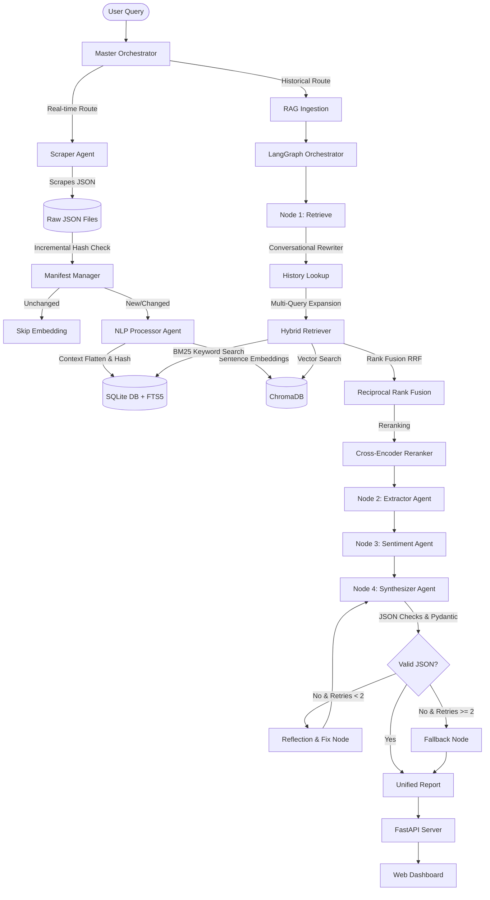

# Reddit Sentiment RAG System: Complete Technical Understanding

This document provides a exhaustive, low-level technical reference of the **Reddit Sentiment Retrieval-Augmented Generation (RAG) System**. It outlines the design patterns, mathematical formulas, state graphs, database schemas, and codebase references.

---

## 1. System Architecture Overview

The system operates as a real-time multi-agent RAG application. It ingests data from Reddit, indexes it in a hybrid search database (semantic and keyword indexes), orchestrates analysis using a cyclical LangGraph flow, and serves it through a FastAPI backend and a premium CSS/HTML glassmorphism dashboard.



---

## 2. Centralized Configuration (`config.py`)

[config.py](file:///c:/Users/nithi/OneDrive/Desktop/Antigravity/Reddit-Sentiment-RAG/config.py) manages paths, environment setups, logging configurations, models, and initialization routines.

### Key Config Details
- **Terminal Encoding Fix**: Checks if `sys.stdout` uses `utf-8` and reconfigures it to handle Unicode emojis during terminal logging.
- **Environment Loading**: Uses `load_dotenv` with `override=True` so that changes in the `.env` file override standard system environment settings.
- **Vector Settings**: Sets ChromaDB storage path to `data/chroma_db` and embedding model to `all-MiniLM-L6-v2`. Uses `hnsw:space: cosine` for cosine distance calculations.
- **LLM Selection**: Integrates with two API gateways:
  - **Google AI Studio**: Uses `ChatGoogleGenerativeAI` with model `gemini-1.5-flash` (or customized via `GOOGLE_MODEL` / `DEEP_ANALYSIS_MODEL`).
  - **OpenRouter**: Uses `ChatOpenAI` pointing to `https://openrouter.ai/api/v1` with model `deepseek/deepseek-r1` (or customized via `LLM_MODEL`).
- **Initialization Helpers**: Exposes thread-safe cache instances:
  - `get_embedding_function()`: SentenceTransformer wrapper for ChromaDB.
  - `get_chroma_collection()`: Initializes a persistent Chroma client.
  - `get_llm()`: Dynamically instantiates the requested model with predefined tokens/temperature.
  - `get_langchain_vectorstore()`: Formats a Chroma client into a LangChain-compatible vector store wrapper.

---

## 3. Data Ingestion & Scraper

Managed by [reddit_scraper.py](file:///c:/Users/nithi/OneDrive/Desktop/Antigravity/Reddit-Sentiment-RAG/scraper/reddit_scraper.py) and [scraper_agent.py](file:///c:/Users/nithi/OneDrive/Desktop/Antigravity/Reddit-Sentiment-RAG/agents/scraper_agent.py).

### 3.1 Proxy Checking & WARP Integration
To bypass Reddit's aggressive rate-limiting, the scraper checks for Cloudflare WARP running on localhost:
- **Port Scanner (`find_warp_port`)**: Scans `40000`, `1080`, `8080`, and `9091` via a TCP socket handshake:
  ```python
  sock = socket.socket(socket.AF_INET, socket.SOCK_STREAM)
  sock.settimeout(0.5)
  result = sock.connect_ex(('127.0.0.1', port))
  ```
- **Proxy Verification**: Configures a SOCKS5 proxy (`socks5://127.0.0.1:<port>`) and requests `https://api.ipify.org?format=json` to verify the IP swap before initiating requests.

### 3.2 Comment Tree Flattening (`process_comment_tree`)
Subreddit comment branches are recursively parsed to compile a simplified comment tree:
1. **Depth Limits**: Enforces depth throttling. The default is level 0 (25 comments), level 1 (15 replies), and level 2 (10 nested replies).
2. **Authority Injection**: Prepends user-type tags directly into comment text:
   - Moderator comments: Distinguished moderator flags are prefixed with `🛡️ [MODERATOR]: <body_text>`.
   - Original Poster comments: Match author names with the thread author to prepend `🔴 [OP/CREATOR]: <body_text>`.
3. **Filtering**: Omits `[deleted]`, `[removed]`, and replies below a minimum score.

### 3.3 Thread-Safe Progress Handling
Updates a global dictionary (`_scrape_state`) inside a thread-safe context (`_scrape_lock`) to feed progress to API polling clients:
- State tracks: `running`, `total`, `completed`, `current_post`, `error`, `finished`, `proxy_ip`, `posts_saved`, and `warnings`.

---

## 4. SQLite Database & Storage Layers

Managed by [db.py](file:///c:/Users/nithi/OneDrive/Desktop/Antigravity/Reddit-Sentiment-RAG/core/db.py) and [manifest_manager.py](file:///c:/Users/nithi/OneDrive/Desktop/Antigravity/Reddit-Sentiment-RAG/core/manifest_manager.py).

The database `reddit_sentiment.db` acts as the relational source of truth and keyword indexing engine.

### 4.1 Schema Definitions
The database creates two primary tables and a virtual FTS5 text index:

#### 1. `analysis_history`
```sql
CREATE TABLE IF NOT EXISTS analysis_history (
    id INTEGER PRIMARY KEY AUTOINCREMENT,
    query TEXT NOT NULL,
    mode TEXT NOT NULL,
    timestamp TEXT NOT NULL,
    sentiment TEXT NOT NULL,
    confidence REAL NOT NULL,
    net_sentiment_score INTEGER NOT NULL,
    report_id TEXT UNIQUE,
    data_freshness TEXT
);
```

#### 2. `documents`
```sql
CREATE TABLE IF NOT EXISTS documents (
    doc_id TEXT PRIMARY KEY,
    content TEXT NOT NULL,
    post_id TEXT NOT NULL,
    post_title TEXT NOT NULL,
    post_url TEXT NOT NULL,
    post_date TEXT NOT NULL,
    post_score INTEGER NOT NULL,
    post_sort TEXT,
    flair TEXT,
    comment_score INTEGER NOT NULL,
    depth INTEGER NOT NULL,
    type TEXT NOT NULL
);
```

#### 3. `documents_fts` (Virtual FTS5 Table)
```sql
CREATE VIRTUAL TABLE documents_fts USING fts5(
    doc_id UNINDEXED,
    content,
    post_title,
    content='documents'
);
```

### 4.2 SQLite Triggers
Automatic sync triggers maintain alignment between the relational `documents` and virtual `documents_fts` tables:
- **`tbl_ai` (After Insert)**:
  ```sql
  CREATE TRIGGER tbl_ai AFTER INSERT ON documents BEGIN
    INSERT INTO documents_fts(rowid, doc_id, content, post_title) 
    VALUES (new.rowid, new.doc_id, new.content, new.post_title);
  END;
  ```
- **`tbl_ad` (After Delete)**:
  ```sql
  CREATE TRIGGER tbl_ad AFTER DELETE ON documents BEGIN
    INSERT INTO documents_fts(documents_fts, rowid, doc_id, content, post_title) 
    VALUES('delete', old.rowid, old.doc_id, old.content, old.post_title);
  END;
  ```
- **`tbl_au` (After Update)**:
  ```sql
  CREATE TRIGGER tbl_au AFTER UPDATE ON documents BEGIN
    INSERT INTO documents_fts(documents_fts, rowid, doc_id, content, post_title) 
    VALUES('delete', old.rowid, old.doc_id, old.content, old.post_title);
    INSERT INTO documents_fts(rowid, doc_id, content, post_title) 
    VALUES (new.rowid, new.doc_id, new.content, new.post_title);
  END;
  ```

### 4.3 FTS5 Search Logic (`search_documents_fts`)
Executes keyword matching on FTS5 virtual columns, using the native `bm25(documents_fts)` ranking:
- Sanitizes the input string (replaces non-alphanumeric chars) and converts search terms into FTS5 prefix wildcards: `term1 OR term2* OR term3*`.
- Executes joining search:
  ```sql
  SELECT d.*, bm25(documents_fts) as rank
  FROM documents d
  JOIN documents_fts fts ON d.doc_id = fts.doc_id
  WHERE documents_fts MATCH ?
  ORDER BY rank LIMIT ?
  ```

### 4.4 Incremental Storage (`ManifestManager`)
To prevent redundant reprocessing of Reddit data, `ManifestManager` tracks files:
- Generates an MD5 file checksum hash using chunked buffer loading (`65536` bytes).
- Stores the mapping `{"filename.json": "md5_hash"}` in `data/rag_ready_data/<subreddit>/embed_manifest.json`.
- Compares hashes on embedding requests; skips indexing if the file has not changed.

---

## 5. Embedding & Ingestion Pipeline

Managed by [embedder.py](file:///c:/Users/nithi/OneDrive/Desktop/Antigravity/Reddit-Sentiment-RAG/rag/embedder.py) and [embed_tool.py](file:///c:/Users/nithi/OneDrive/Desktop/Antigravity/Reddit-Sentiment-RAG/agents/tools/embed_tool.py).

Reads scraped JSON posts and comments, flattens them, generates contextual embeddings, and inserts batches into ChromaDB and SQLite.

### 5.1 Deduplication Algorithm
Avoids duplicate chunks by generating a deterministic, unique 16-character MD5 hash for each document:
$$\text{unique\_str} = \text{post\_id} + \text{"\_"} + \text{type} + \text{"\_"} + \text{depth} + \text{"\_"} + \text{content[:200]}$$
$$\text{doc\_id} = \text{MD5}(\text{unique\_str})[:16]$$

### 5.2 Contextual Reply Expansion (`flatten_comments`)
Vector search retrievals lose metadata context when replies are fetched in isolation. To counter this, parent comment context is appended:
- **Preprocessing**: If a comment is a reply, we prepend a snippet of the parent comment:
  ```
  [Reply to: <first_200_chars_of_parent_comment>...]
  
  <comment_body>
  ```
- This ensures that semantic searches match relevant parent context queries even if the sub-reply text only uses conversational terms (e.g., "Yeah I agree, he is terrible").

### 5.3 Text Splitting & Batching
- Splitter: `RecursiveCharacterTextSplitter` (chunk size 1500, overlap 200) splits long post bodies.
- Writes to databases in batches of `100` elements to speed up disk I/O.

---

## 6. Advanced Retrieval Engine

Managed by [retriever.py](file:///c:/Users/nithi/OneDrive/Desktop/Antigravity/Reddit-Sentiment-RAG/rag/retriever.py) and [search_tool.py](file:///c:/Users/nithi/OneDrive/Desktop/Antigravity/Reddit-Sentiment-RAG/agents/tools/search_tool.py).

### 6.1 Multi-Query Expansion & Router
Invokes the LLM to analyze the user's intent. The LLM generates query alternatives and selects a retrieval strategy:
- **SEMANTIC**: General conceptual opinions. Bypasses FTS5 database queries.
- **HYBRID**: Specific names, dates, scores, or matches. Fuses database FTS5 and Chroma vector stores.
- Generates 3 query variations to expand semantic coverage.

### 6.2 Parallel Query Execution
Uses `ThreadPoolExecutor` to query ChromaDB in parallel for all 4 generated queries (original + 3 variations), then deduplicates the combined results:
```python
with ThreadPoolExecutor(max_workers=len(queries)) as executor:
    results = list(executor.map(fetch_docs, queries))
```

### 6.3 Reciprocal Rank Fusion (RRF)
Combines ranked lists from semantic search ($L_{vector}$) and FTS5 BM25 keyword search ($L_{fts5}$):

$$RRF\_Score(d) = \sum_{m \in \{L_{vector}, L_{fts5}\}} \frac{1}{rank_m(d) + k}$$

where $k$ is a constant smoothing factor (default: `60`), and $rank_m(d)$ is the position index of document $d$ in list $m$.

### 6.4 Cross-Encoder Semantic Reranking
Calculates semantic similarity between the query and candidate documents using the model `cross-encoder/ms-marco-MiniLM-L-6-v2`:
- Calculates a prediction score for each query-document pair.
- Multiplies the similarity score by the `temporal_decay_factor` to yield `final_combined_score`.
- Re-sorts the documents descending by this score.

---

## 7. Multi-Agent Orchestration (LangGraph)

Managed by [rag_agent.py](file:///c:/Users/nithi/OneDrive/Desktop/Antigravity/Reddit-Sentiment-RAG/agents/rag_agent.py), [orchestrator.py](file:///c:/Users/nithi/OneDrive/Desktop/Antigravity/Reddit-Sentiment-RAG/agents/orchestrator.py), and [schemas.py](file:///c:/Users/nithi/OneDrive/Desktop/Antigravity/Reddit-Sentiment-RAG/agents/schemas.py).

### 7.1 Master Orchestrator Decision Tree
When a query enters the system:
1. **Intention Router**: An LLM parses the user query.
2. If the user requests real-time data ("what is the sentiment today on r/apple"):
   - Routes to **Scraper Agent** to scrape the target subreddit.
   - Routes to **NLP Processor Agent** to parse and embed the new JSON files.
3. Continues to the RAG synthesis graph.

### 7.2 Conversational Query Rewriting
Before retrieving documents, the graph retrieves the last 5 history items from the SQLite database.
If history exists, it uses `REWRITER_PROMPT` to rewrite follow-up queries:
- **Example**: If query is "What about ownership?" and history contains "What is the sentiment about Manchester United manager?", it rewrites it to "What is the sentiment about Manchester United team ownership?".

### 7.3 LangGraph Nodes & Pipeline

The pipeline is modeled as a state machine using LangGraph's `StateGraph`:

```
[retrieve] ➔ [extract] ➔ [analyze_sentiment] ➔ [synthesize] ──► (Success?)
                                                     ▲            │
                                                     │ (No)       │ (Yes)
                                               [reflect_and_fix]  ▼
                                                     ▲          [END]
                                                     │ (Retries < 2)
                                                     │
                                               [fallback] (Retries >= 2)
```

#### Node Details:
1. **Retrieve Node**: Reformulates the query using conversation history, fetches 15 hybrid documents, and formats the context.
2. **Extractor Agent**: Extracts factual assertions, polarizations, quotes, and date ranges. Keeps fact extraction separate from sentiment analysis.
3. **Sentiment Agent**: Assesses positive and negative emotional tone (anger, frustration, hope, satisfaction, disappointment, excitement, sarcasm, resignation), checks sarcasm, models controversy score (0.0-1.0), and structures team insights.
4. **Synthesizer Agent**: Generates the final JSON output structure matching the `UnifiedAnalysisReport` Pydantic model.
5. **Reflection Node (`reflect_and_fix`)**: If JSON decoding or schema rules fail, it passes the error stack and invalid JSON to the reflection LLM to fix it.
6. **Fallback Node**: If error correction fails 2 consecutive times, it generates a valid JSON structure using regex extraction and fallbacks to prevent pipeline failure.

### 7.4 Validation Rules
To ensure high quality, the synthesizer evaluates these constraints:
1. **Percentages**: $Positive\% + Negative\% + Neutral\% = 100\%$
2. **Signal Themes**: At least 2 positive and 2 negative themes (with evidence counts and quotes).
3. **Quotes**: At least 3 praise quotes and 3 criticism quotes.
4. **Entities**: At least 3 entities (Product, Person, Feature, Event, or Other).
5. **Insights**: At least 2 actionable insights per team (Product, Marketing, and Support).

---

## 8. FastAPI API Server (`app.py`)

[app.py](file:///c:/Users/nithi/OneDrive/Desktop/Antigravity/Reddit-Sentiment-RAG/app.py) runs the backend server, background threads, and progress streaming.

### 8.1 SSE (Server-Sent Events) Status Streaming
Enables real-time progress updates in the web dashboard during multi-agent analysis:
- The endpoint `/api/analyze/stream/{job_id}` returns a `StreamingResponse` with the media type `text/event-stream`.
- A background worker thread executes the analysis.
- The controller checks the `AnalysisJob` event log and streams updates to the frontend:
  ```python
  async def event_generator():
      last_idx = 0
      while True:
          events = job.get_events_since(last_idx)
          for e in events:
              yield f"data: {json.dumps(e)}\n\n"
              last_idx += 1
          if job.status in ["completed", "failed"]:
              break
          await asyncio.sleep(0.5)
  ```

### 8.2 Job Store Cleanup Daemon
Managed by `JobStore` to prevent memory leaks from inactive jobs:
- Launches a daemonized cleanup thread `job-store-cleanup` during initialization.
- Every 5 minutes, it purges job IDs older than `3600` seconds:
  ```python
  to_delete = [
      job_id for job_id, job in self.jobs.items()
      if job.status in ("completed", "failed")
      and job.events
      and (now - job.events[-1]["timestamp"]) > JOB_TTL_SECONDS
  ]
  ```

### 8.3 LLM-Filtered Word Cloud Engine
The `/api/wordcloud` endpoint generates key entities for word cloud visuals:
1. Extracts word frequencies from the last 200 documents, removing standard stop words.
2. Passes the top 100 candidate words to the LLM to identify actual entities:
   - Excludes emotional terms (e.g., "great", "bad") and generic verbs.
   - Includes real entities (people, products, organizations, movies, concepts).
3. Formats and returns the top 40 entities.

### 8.4 Styled Report Downloads
The `/api/report/{report_id}/download` endpoint generates custom reports:
- **Markdown**: Returns structured plaintext.
- **HTML**: Renders a dark-themed, glassmorphic report with CSS variables, progress bars, responsive columns, and sentiment badges.

---

## 9. Codebase Reference Map

| Directory / File | Technical Role |
| :--- | :--- |
| [`app.py`](file:///c:/Users/nithi/OneDrive/Desktop/Antigravity/Reddit-Sentiment-RAG/app.py) | Main server exposing REST APIs, serving static files, hosting background jobs, and formatting reports. |
| [`config.py`](file:///c:/Users/nithi/OneDrive/Desktop/Antigravity/Reddit-Sentiment-RAG/config.py) | Configuration hub handling paths, credentials, and lazy DB/LLM connection instantiations. |
| [`mcp_server.py`](file:///c:/Users/nithi/OneDrive/Desktop/Antigravity/Reddit-Sentiment-RAG/mcp_server.py) | FastMCP server exposing `analyze_reddit_sentiment` and `get_reddit_database_stats` tools. |
| [`scraper/reddit_scraper.py`](file:///c:/Users/nithi/OneDrive/Desktop/Antigravity/Reddit-Sentiment-RAG/scraper/reddit_scraper.py) | Native scraper that scans for WARP proxies, scrapes comment trees, and handles rate-limits. |
| [`core/db.py`](file:///c:/Users/nithi/OneDrive/Desktop/Antigravity/Reddit-Sentiment-RAG/core/db.py) | Database manager configuring SQLite tables, FTS5 virtual indexes, triggers, and history tables. |
| [`core/manifest_manager.py`](file:///c:/Users/nithi/OneDrive/Desktop/Antigravity/Reddit-Sentiment-RAG/core/manifest_manager.py) | Tracks file MD5 checksums for incremental embedding. |
| [`core/job_store.py`](file:///c:/Users/nithi/OneDrive/Desktop/Antigravity/Reddit-Sentiment-RAG/core/job_store.py) | In-memory job repository with automated cleanup threads. |
| [`core/llm_utils.py`](file:///c:/Users/nithi/OneDrive/Desktop/Antigravity/Reddit-Sentiment-RAG/core/llm_utils.py) | JSON parsing utilities that handle markdown fences and raw text extraction. |
| [`rag/embedder.py`](file:///c:/Users/nithi/OneDrive/Desktop/Antigravity/Reddit-Sentiment-RAG/rag/embedder.py) | NLP pipe flattening comments, generating MD5 hashes, and storing data. |
| [`rag/retriever.py`](file:///c:/Users/nithi/OneDrive/Desktop/Antigravity/Reddit-Sentiment-RAG/rag/retriever.py) | Hybrid retriever executing multi-query expansion, FTS5/vector searches, RRF, and Cross-Encoder reranking. |
| [`rag/generator.py`](file:///c:/Users/nithi/OneDrive/Desktop/Antigravity/Reddit-Sentiment-RAG/rag/generator.py) | Serves Quick Mode by running single-shot conversational summaries. |
| [`agents/orchestrator.py`](file:///c:/Users/nithi/OneDrive/Desktop/Antigravity/Reddit-Sentiment-RAG/agents/orchestrator.py) | Master intent router directing incoming queries to scraper pipelines or RAG graphs. |
| [`agents/rag_agent.py`](file:///c:/Users/nithi/OneDrive/Desktop/Antigravity/Reddit-Sentiment-RAG/agents/rag_agent.py) | LangGraph sentiment pipeline compiling the multi-agent system state transitions. |
| [`agents/schemas.py`](file:///c:/Users/nithi/OneDrive/Desktop/Antigravity/Reddit-Sentiment-RAG/agents/schemas.py) | Pydantic validation models and fallback template schemas. |
| [`agents/tools/`](file:///c:/Users/nithi/OneDrive/Desktop/Antigravity/Reddit-Sentiment-RAG/agents/tools/) | Directory containing tools (`scrape_subreddit_tool`, `embed_data_tool`, `vector_search_tool`) for ReAct agents. |
| [`static/`](file:///c:/Users/nithi/OneDrive/Desktop/Antigravity/Reddit-Sentiment-RAG/static/) | Glassmorphism dashboard files (`index.html`, `styles.css`, `app.js`). |
| [`prompts/`](file:///c:/Users/nithi/OneDrive/Desktop/Antigravity/Reddit-Sentiment-RAG/prompts/) | Directory containing the external prompt text templates dynamically loaded by the retriever, generator, and multi-agent loops at runtime. |
| [`data/`](file:///c:/Users/nithi/OneDrive/Desktop/Antigravity/Reddit-Sentiment-RAG/data/) | Persists database, Chroma indices, report cache files, and scraped JSON files. |
